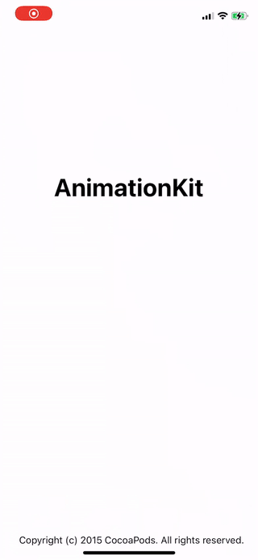

<p align="center">
  
</p>

# AnimationKit

[](https://travis-ci.org/devyhan93@gmail.com/AnimationKit)
[](https://cocoapods.org/pods/AnimationKit)
[](https://cocoapods.org/pods/AnimationKit)
[](https://cocoapods.org/pods/AnimationKit)

## Example

To run the example project, clone the repo, and run `pod install` from the Example directory first.

## Requirements

- Xcode 10.0+
- Swift 5.0+

## Installation

AnimationKit is available through [CocoaPods](https://cocoapods.org). To install
it, simply add the following line to your Podfile:

```ruby
pod 'AnimationKit'
```

## Usage
#### *Quick Start*

<p align="center" style="display: flex;justify-content: space-between;">
  
</P>

```swift
import AnimationKit

class MyViewController: UIViewController {

    let motionView = UIView()

    override func viewDidLoad() {
        super.viewDidLoad()

        self.view.addSubview(motionView)
        
        // motionView constant code
        // ...

        ani.fadeIn(target: motionView)
    }
}
```

## Author

devyhan93@gmail.com

## License

AnimationKit is available under the MIT license. See the LICENSE file for more info.
